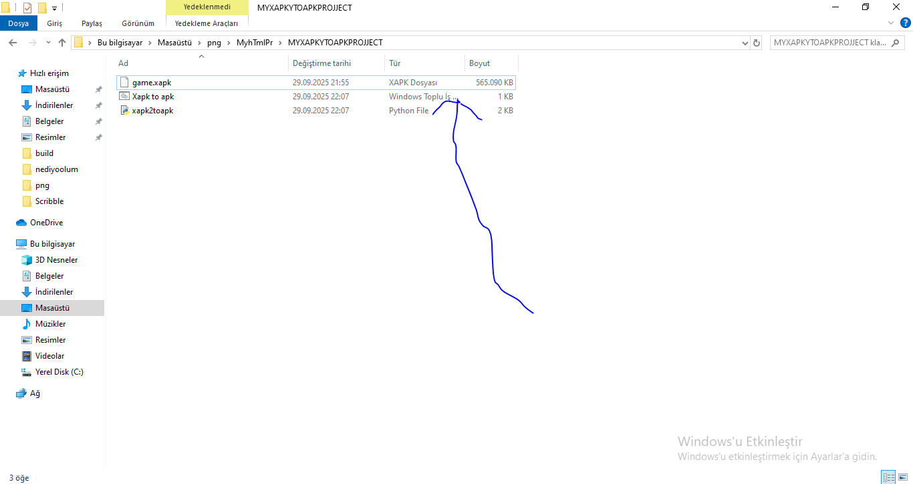
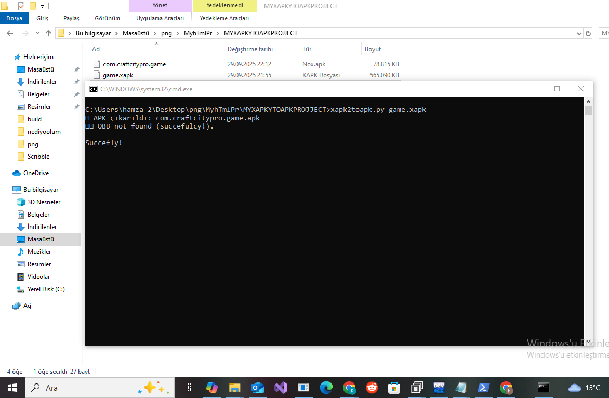
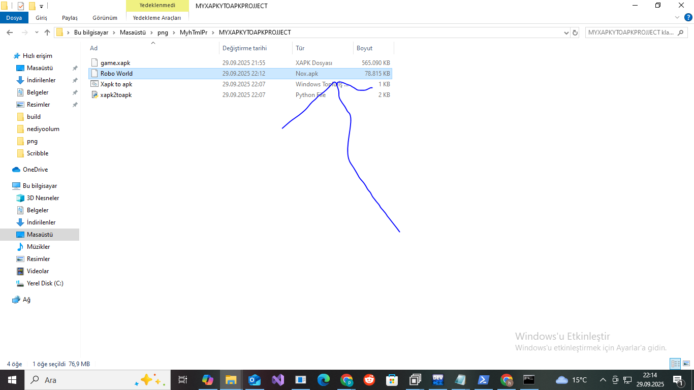

How to use it: Open the .bat file, and the xapk file name must be game, otherwise it won't work. If it says "obb not found," that's normal. It's not an error. Every xapk is like this, and it doesn't require any additional libraries. However, if the file you provide is large, it will work on older devices. Files with a minimum size of 60 MB or 100 MB If you still don't understand, read the above again.

## 📸 Screenhorts

  
  

